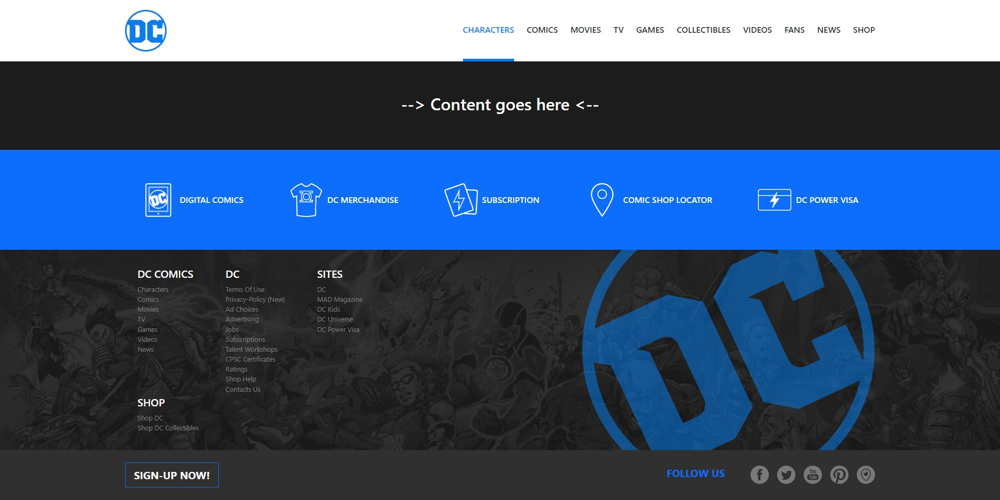
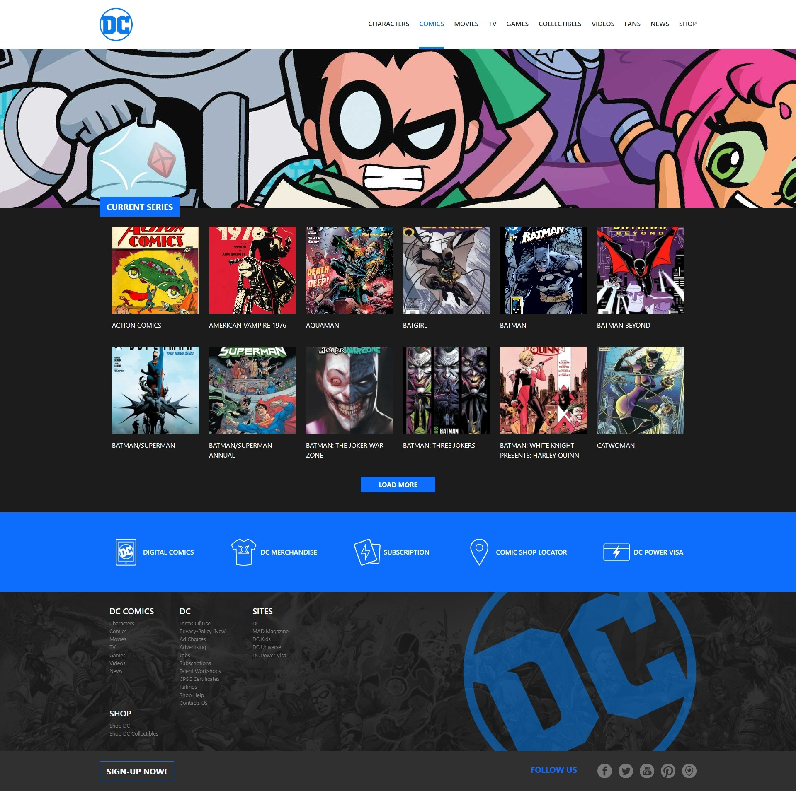
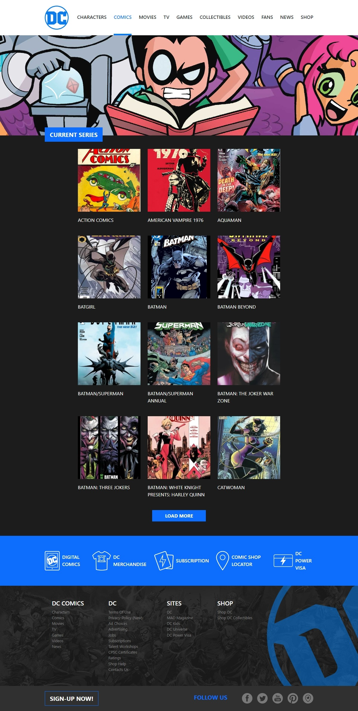
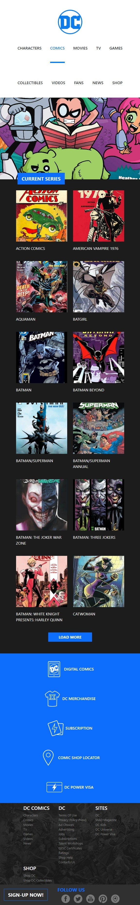

# Boolean - vite-comics

This is a solution to the vite-comics challenge of [Boolean](https://boolean.careers/). Boolean help you improve your coding skills by building realistic projects with an increasingly high level of difficulty. 

## Table of contents

- [Overview](#overview)
  - [The challenge](#the-challenge)
  - [Screenshot](#screenshot)
    - [Page not implemented](#page-not-implemented)
    - [Comics desktop](#comics-desktop)
    - [Comics tablet](#comics-tablet)
    - [Comics mobile](#comics-mobile)
  - [Links](#links)
- [My process](#my-process)
  - [Built with](#built-with)
  - [Useful resources](#useful-resources)
- [Author](#author)

## Overview

### The challenge

Users should be able to:

- View the optimal layout depending on their device's screen size
- Navigate between implemented pages using the navbar

### Screenshot

#### Page not implemented

#### Comics desktop

#### Comics tablet

#### Comics mobile

### Links

- Solution URL: [https://github.com/totarochristian/vite-comics](https://github.com/totarochristian/vite-comics)

## My process

### Built with

- Semantic HTML5 markup
- CSS custom properties
- Flexbox
- Bootstrap
- Vue
- Vite

### Useful resources

- [Boostrap documentation](https://getbootstrap.com/) - This helped me to learn how to use the Bootstrap framework during the construction of this site.
- [Vue documentation](https://vuejs.org/guide/introduction.html) - This helpe me to learn how to use Vue during the construction of this site.

## Author

- GitHub - [@totarochristian](https://github.com/totarochristian)
- Frontend Mentor - [@totarochristian](https://www.frontendmentor.io/profile/totarochristian)
- Linkedin [Christian Totaro](https://www.linkedin.com/in/christian-totaro-080a7018a/)